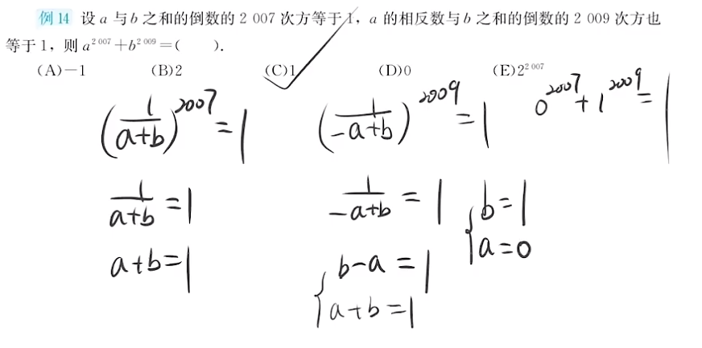
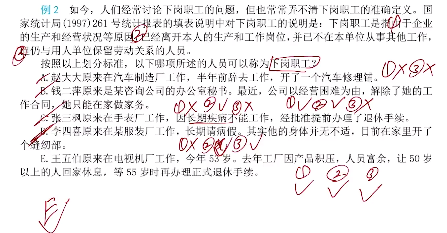
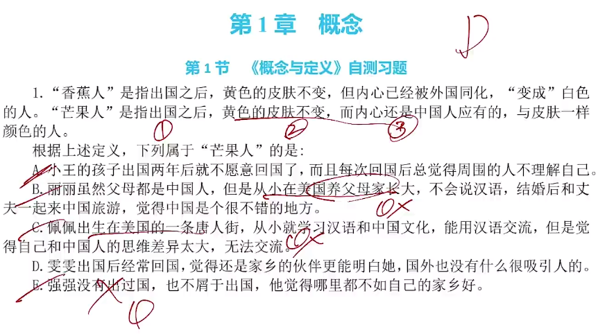
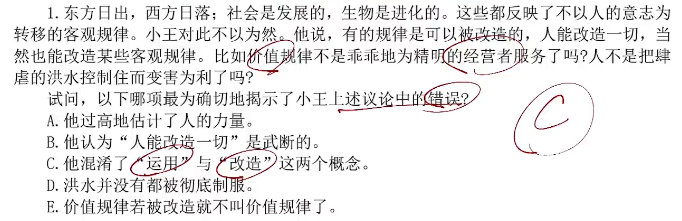
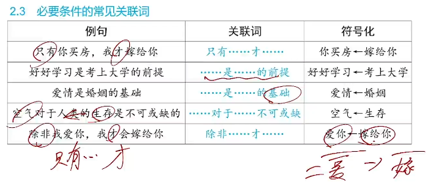
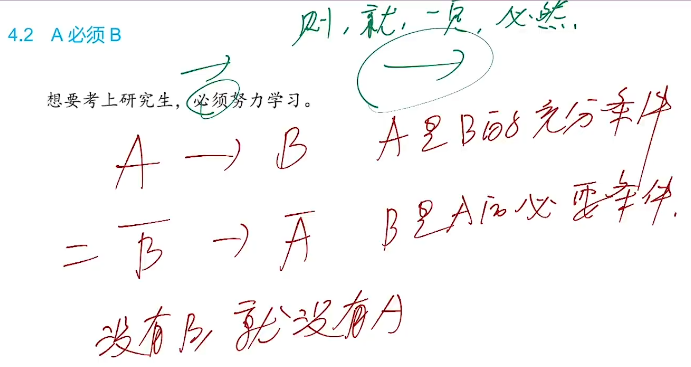
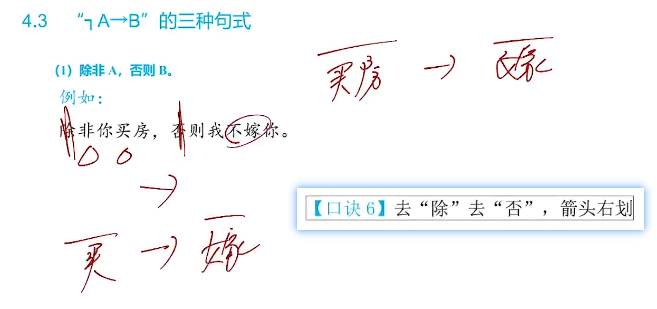
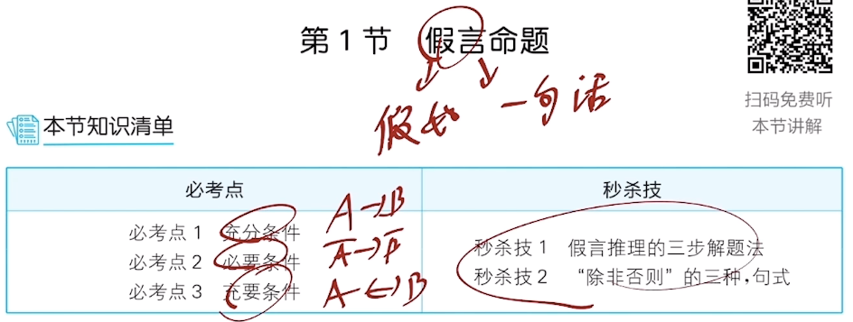

**199管理综合笔记**

* 乐学喵 - 老吕

# 数学基础部分

## 大纲

## 第一章 算数

### 一、实数

#### 1.实数的分类

#### 2.整除

#### 3.奇数与偶数

#### 4.质数与合数

#### 5.约数和倍数

#### 6.有理数和无理数

#### 7.实数的乘方与开方

#### 习题自测

# 逻辑基础部分

## 命题情况

## 形式逻辑

### 知识框架

### 第一章 概念

#### 一、概念与定义

##### 1.概念与定义

##### 2.概念的种类

##### 习题自测

#### 二、概念的划分与关系

##### 1.概念的划分

##### 2.概念之间的关系

##### 3.四种与概念的关系有关的谬误

##### 习题自测

### 第二章 判断

#### 知识框架

#### 一、复合判断

##### 1.假言判断

###### 1).充分条件

###### 2).必要条件

###### 3).充要条件

###### 4).画“箭头”的特殊句式

# 逻辑要点七讲

## 第一讲 形式逻辑

### 知识框架

### 一、复言命题

#### 1.假言命题

##### 1).充分条件

##### 2).必要条件

##### 3).充要条件

##### 4).秒杀技1

##### 5).秒杀技2

#### 2.联言选言命题

##### 1).联言命题

