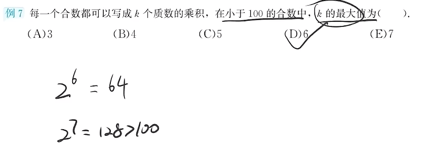
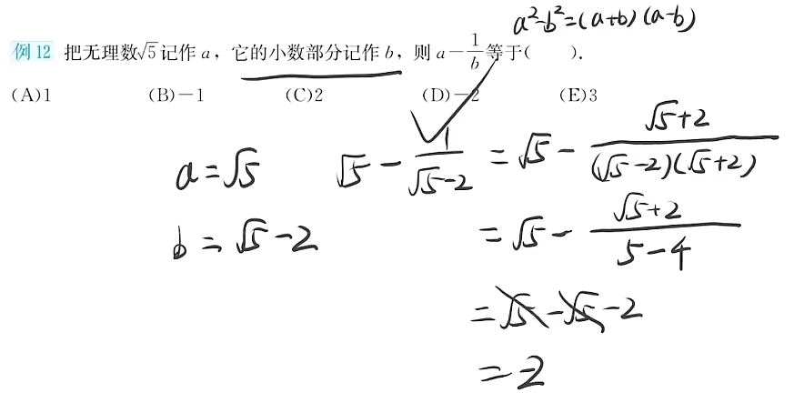
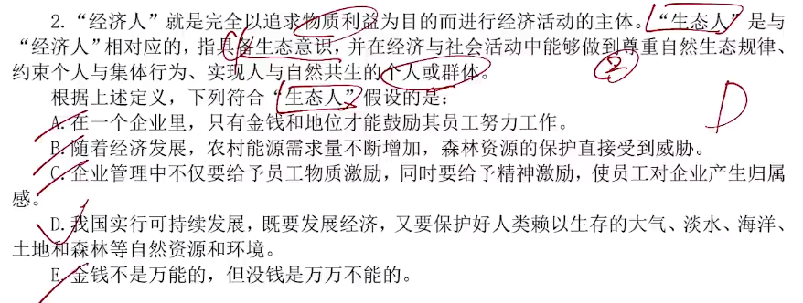

**199管理综合笔记**

* 乐学喵 - 老吕

# 数学部分

## 大纲

## 第一章 算数

### 一、实数

#### 1.实数的分类

#### 2.整除

#### 3.奇数与偶数

#### 4.质数与合数

#### 5.约数和倍数

#### 6.有理数和无理数

#### 7.实数的乘方与开方

#### 习题自测

# 逻辑部分

## 命题情况

## 形式逻辑

### 知识框架

### 第一章 概念

#### 一、概念与定义

##### 1.概念与定义

 

##### 2.概念的种类

##### 习题自测

 
